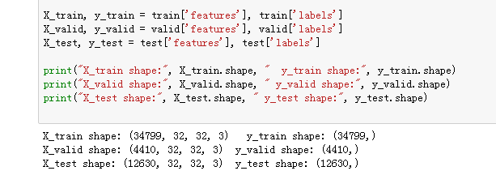
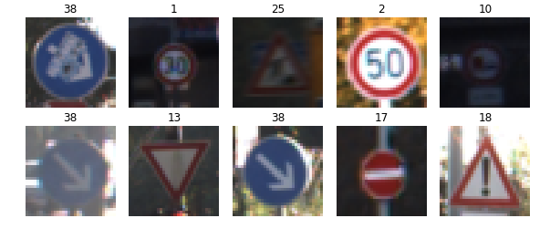
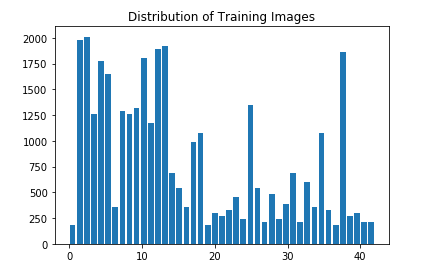
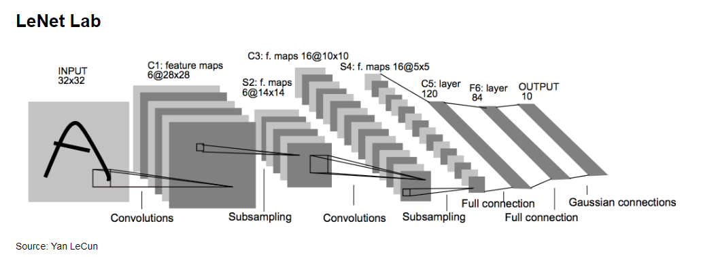
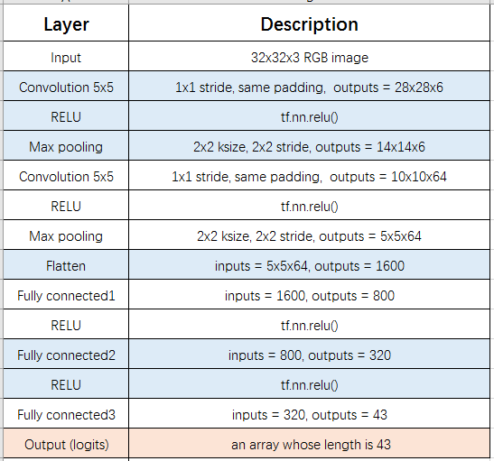
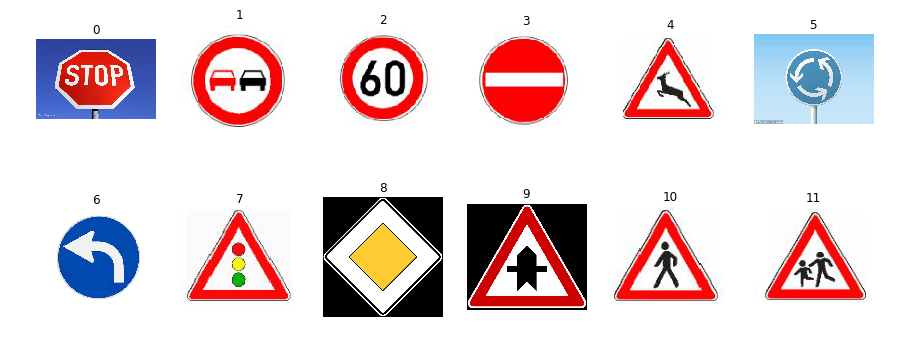
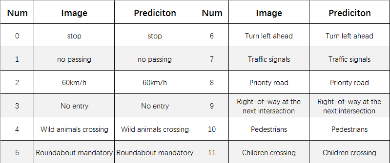
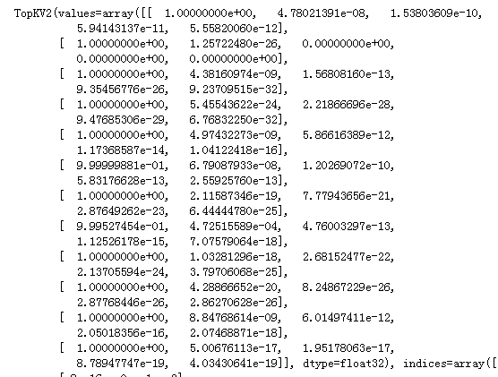

# Traffic Sign Recognition
Overview
---

The goals of this project are the following:
* Build a convolutional neural network (CNN) using Tensorflow to classify traffic signs.
* Reflect on my work in a written report

Contents
---
**Build a Traffic Sign Recognition Project**

The steps of this project are the following:

* Load the data set (see below for links to the project data set)
* Explore, summarize and visualize the data set
* Design, train and test a model architecture
* Use the model to make predictions on new images
* Analyze the softmax probabilities of the new images
* Summarize the results with a written report

### Data Set Summary & Exploration
I have used [German Traffic Sign Dataset](http://benchmark.ini.rub.de/?section=gtsrb&subsection=dataset) which includes 34799 training images,
4410 valid images and 12630 test images, in addition the corresponding labels. And the color traffic images are with RGB channels. Here is a picture shows information about the traffic sign dataset:

Here is a random sample of images from each class : 


There are a total of 43 classes or labels in the dataset. Here is the distribution of classes in training set : 

It is a bar chart showing how this 43 classes distribute.

### Design and Test a Model Architecture
#### 1. Normalize the image data.
With the normalize funciton, Normalize a list of sample image data in the range of 0 to 1, input a list of image data whose shape is 
(32, 32, 3), return Numpy array of normalize data.

#### 2. CNN architecture
The model I have chosen is inspired by LeNet architecture from Yan LeCun.

But i choose different output in the layer.

#### Input
The LeNet architecture accepts a 32x32xC image as input, where C is the number of color channels.  C is 3 in this case.

#### Architecture
**Layer 1: Convolutional.** The output shape is 28x28x6.

**Activation.** ReLu activation.

**Pooling.** The output shape is 14x14x6.

**Layer 2: Convolutional.** The output shape is 10x10x64.

**Activation.** ReLu activation.

**Pooling.** The output shape is 5x5x64.

**Flatten.** Flatten the output shape of the final pooling layer such that it's 1D instead of 3D. I use `tf.contrib.layers.flatten`

**Layer 3: Fully Connected.** This has 800 outputs.

**Activation.** ReLu activation.

**Layer 4: Fully Connected.** This should have 320 outputs.

**Activation.** ReLu activation.

**Layer 5: Fully Connected (Logits).** This has 43 outputs.

#### Output
Return the result of the 2nd fully connected layer.

My final model consisted of the following layers:


#### 3. Trained the model. 
To train the model, I choose Adam optimizer with learning rate = 0.006. I make batch size to 128 and epochs equal to 15.
#### 4. Make better model
At first, i used the Lenet architecture which has a better proformance in classfing grayscale images(incluing cars, birds, ...), but it seems not good enough on traffic signs classification, then i begin to try to exchange the CNN architecture, i make the CNN more bigger in output, and try kinds of learning rate and epochs, at the same time i used different functions to normalize the image data in the pre-process stage.
In the last, I get validation set accuracy of 95.2%, test validation set accuracy of 92.9%

### Test a Model on New Images
#### 1. Choose 12 German traffic signs to test the model


#### 2. The model's predictions on these new traffic signs 
I think the image is very clear and it is easy for the model to predict, so i think the model should get 100% accuracy, in fact it is! It is great.
Here are the results of the prediction:


#### 3. Top 5 probabilities for each image
Describe how certain the model is when predicting on each of the five new images by looking at the softmax probabilities for each prediction. Provide the top 5 softmax probabilities for each image along with the sign type of each probability

From the picture above, the classifier predicts the signs with a near 100% certainty.


```python

```
